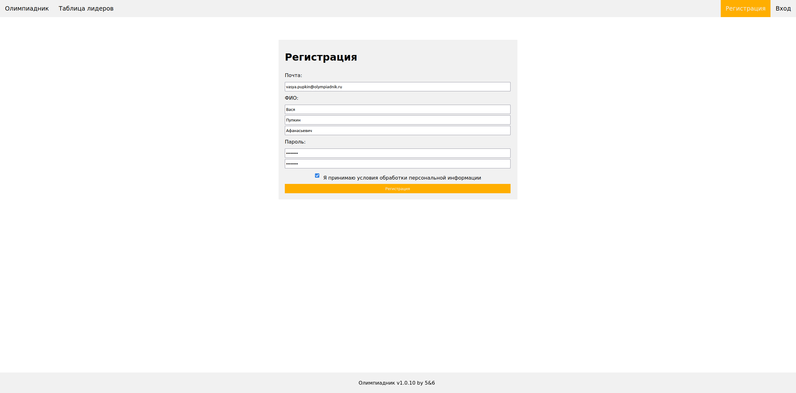
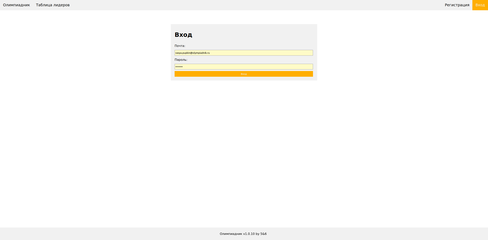
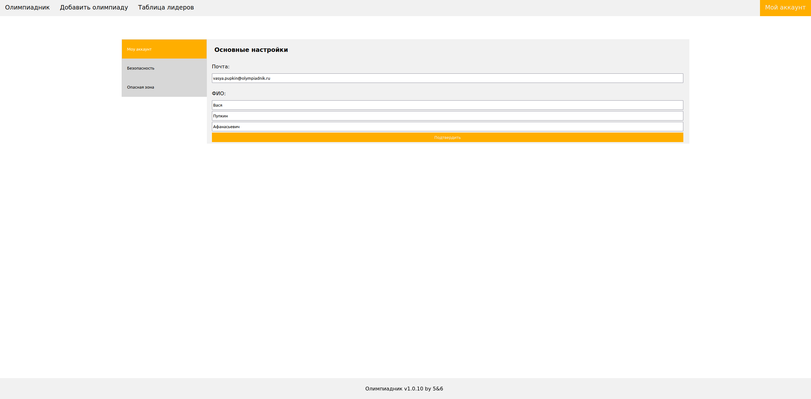
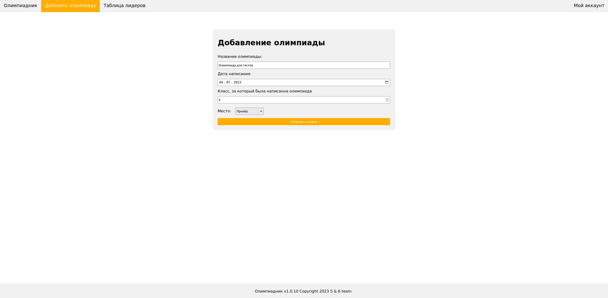

# Сайт "Олимпиадник"

## Обзор

### Аккаунты

Аккаунты существуют трёх типов:

- Аккаунт ученика
- Аккаунт администратора (может управлять учениками)
- Аккаунт разработчика (Администратор, который не может быть забанен другими администраторами)

#### Создание аккаунта

Аккаунт можно создать на странице регистрации (`/user/register/`)



При регистрации необходимо указать электронную почту, ФИО, пароль. Если всё прошло успешно, вас перебросят на главную страницу.

#### Вход в аккаунт

Войти в аккаунт можно на странице (`/user/login/`)



При входе необходимо указать электронную почту и пароль. Если всё прошло успешно, вас перебросит на главную страницу.

#### Просмотр аккаунта

Что бы посмотреть свой аккаунт используйте кнопку "Мой аккаунт"

#### Редактирование аккаунта

Что бы отредактировать свой аккаунт, зайдите на страницу с вашим аккаунтом. Затем нажмите "Изменить аккаунт".



#### Другие действия

- **Изменение пароля**. Это можно сделать во вкладке "Безопасность" в настройках.
- **Выход из аккаунта**. Это можно сделать во вкладке "Опасная зона" в настройках.
- **Удаление аккаунта/олимпиады/прочих сведеньях**. Не реализованно на сайте, обратитесь к администратору: `ig.samsonov10@yandex.ru`.

### Добавление олимпиады

Перейдите во вкладку "Добавить олимпиаду", заполните форму. Пример:



За написанную олимпиаду система начислит вам какое-то количество *очков*.

### Таблица лидеров

Во вкладке "Таблица лидеров" можно посмотреть количество очков у разных учеников. Ученики не будут отображаться если они забанены или скрыты.

### Функционал аккаунта администратора

Аккаунт администратора позволит вам:

- Регистрировать олимпиады (Делать из доступными для выбора)
- Смотреть списки учеников и их успехов

## Запуск

Рекомендовано использовать `docker compose`:

```yaml
version: "3.9"

services:
  web:
    build: ./app # Поместите код в папку app
    ports:
      - "17025:17025" # Олимпиадник работает на порту 17025
    restart: on-failure # Перезапуск в случае ошибки
    volumes: 
      - ./app:/app
    command: python3 Main.py
```
